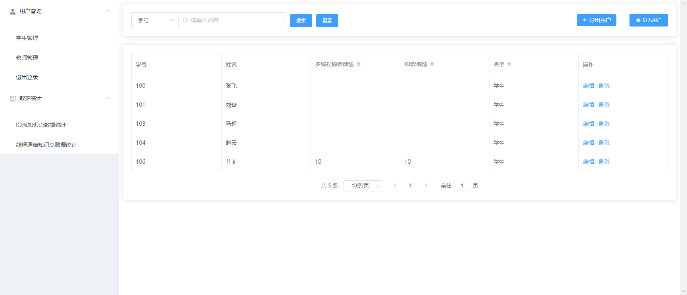

# 洪学习游戏平台

> 一款简单的答题闯关游戏，练练手
>
> 本来想做成可配置可拓展的游戏平台，但因为时间，精力问题(996甚至997了将近一年、且不知什么时候结束)，暂时只是写了这两个简单的小游戏demo，后续有时间将会重构拓展该项目

## 介绍

>* 将知识点融入游戏中、以游戏的方式进行考核检测学生知识点掌握情况;
>* 主要分为答题游戏部分及管理统计部分;
>* 激发学生兴趣的同时方便老师查看统计数据
>* 后续会逐渐拓展程序,做成可配置式游戏平台（暂时没时间）

###  技术栈

> 1. 使用vue+element-ui+echarts框架进行前端开发
>
> 2. 使用nodejs+express+mysql进行后台开发（存放用户数据，闯关数据，用作统计）
>
> 3. 前后端分离开发

## 效果展示

> 通过路由跳转不同的游戏

### 1 、登录界面

>可切换学生登陆/教师登录，通过不同的登录选项会跳转不同的界面，其中学生跳转到游戏界面，教师跳转到管理界面
>
>
>
>

### 2、Java基础知识游戏界面

#### Ⅰ- 首页

>截取了一部分的游戏界面
>
>
>
>

#### Ⅱ - 游戏准备界面

>

#### Ⅲ - 答题界面

>###### （1）答题错误
>
>
>
>###### （2）答题成功
>
>
>
>（3）答题成功后的一些原理展示
>
>
>
>（4）闯关成功/失败的页面
>
>

#### Ⅳ - 答题排行

>可以查看用户的得分、用时情况以及排行
>
>

### 3、IO基础知识闯关游戏界面

#### Ⅰ - 首页

>
>
>

#### Ⅱ - 游戏界面

>与上面的Java界面大致相同，只是题目与主体换了，就大致截图一下，不再赘述
>
>
>
>
>
>

### 4、教师管理界面

#### Ⅰ - 用户管理界面

>导入导出用户/修改用户信息与密码
>
>

#### Ⅱ - 数据统计界面

>可以统计平均的得分/失分情况，学号是模糊查询，通过学号可以查询统一届甚至同一专业的学生的平均数据，图形统计结果根据查询出来的结果进行计算变换
>
>###### （1）得分/失分情况统计
>
>
>
>##### （2）可只看得分 or 失分 情况
>
>
