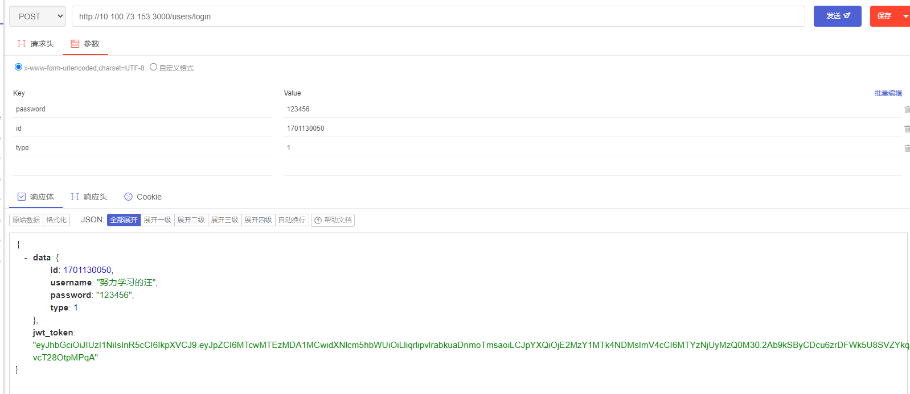
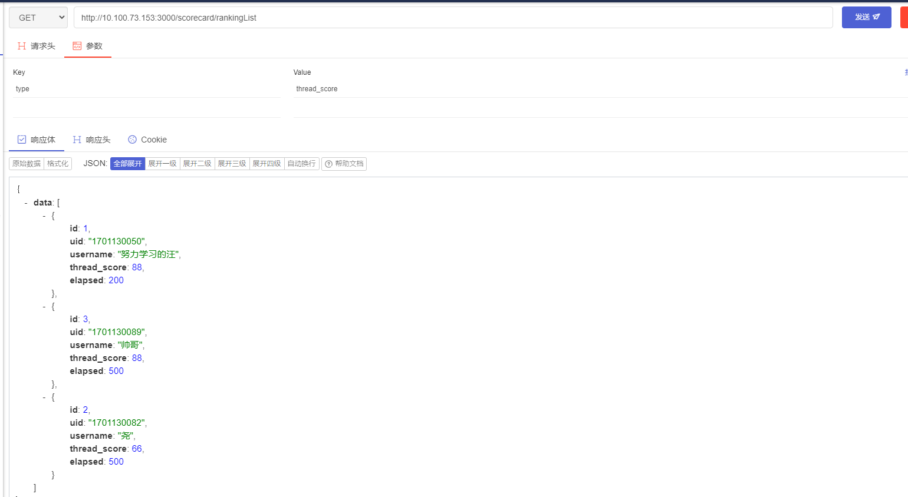
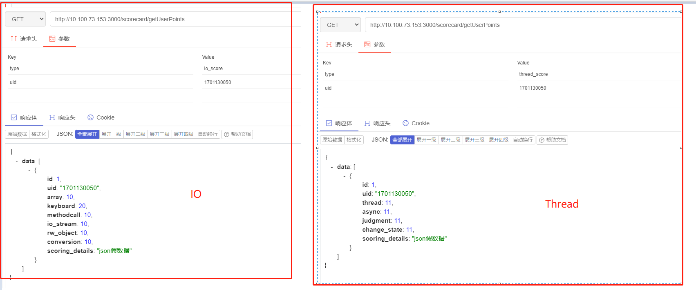
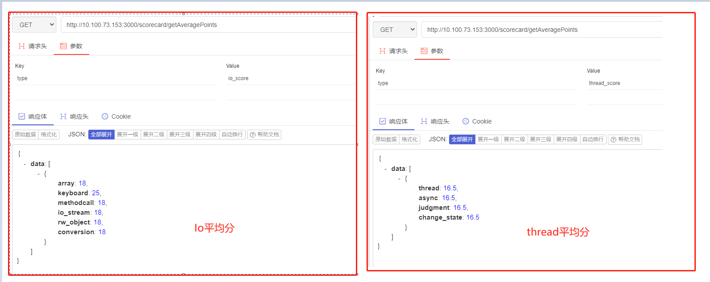

# #说明

>地址:https://gitee.com/hongjilin
>
>此为项目初始版本的接口文档

# #目录

>[TOC]

# 闯关游戏接口文档(努力学习的汪)

## 1、API  接口说明(后期补充)

- 接口基准地址：根据自己需求更改,自己本机电脑就`http://localhost:...`
- 数据返回格式统一使用 JSON (如有其他格式将在接口文档声明)

### Ⅰ - 支持的请求方法

- POST
- GET

### Ⅱ - 通用返回状态说明

| *状态码* | *含义*                | *说明*           |
| -------- | --------------------- | ---------------- |
| 200      | OK                    | 请求成功         |
| 404      | NOT FOUND             | 请求的资源不存在 |
| 500      | INTERNAL SERVER ERROR | 内部服务端错误   |

## 2、 数据库 设计 

>数据库名 : io_server
>
>数据库账号 : root
>
>数据库密码 : root
>
>数据库 :utf8  排序规则 :utf8_bin
>

### Ⅰ - 用户表 ( user )

| *字段名*       | *含义*                 | 数据类型 | *说明*                                         |
| -------------- | ---------------------- | -------- | ---------------------------------------------- |
| id             | 用户id(学号或者教师号) | varchar  | 非空                                           |
| <u>*token*</u> | 加密后的数据           | varchar  | (可不使用)                                     |
| username       | 用户                   | varchar  | 非空                                           |
| password       | 密码                   | varchar  | 非空                                           |
| type           | 用户类型               | int      | 1:学生;  2:教师  (不传默认为学生) 3:超级管理员 |

### Ⅱ -  IO分数表 ( io_scorecard )

| *字段名* | *含义io_*                        | 数据类型 | *说明*             |
| -------- | -------------------------------- | -------- | ------------------ |
| id       | 成绩主键,自增                    | int      | 非空               |
| uid      | 成绩关联的用户                   | varchar  | 非空               |
| username | 用户名                           | varchar  | 非空(取数据更方便) |
| io_score | 某用户的IO流答题闯关游戏最高成绩 | int      | (默认0分)          |
| elapsed  | 记录时间                         | int      | 消耗的秒数         |

### Ⅲ -  IO 知识点情况表 (io_points)

| *字段名*        | 含义         | 数据类型 | *说明*                         |
| --------------- | ------------ | -------- | ------------------------------ |
| id              | 主键,自增    | int      |                                |
| uid             | 关联的用户id | varchar  |                                |
| array           | 数组         | int      | 对应题目编号: 1                |
| keyboard        | 键盘输入     | int      | 2,3,4                          |
| methodcall      | 方法的调用   | int      | 5                              |
| io_stream       | 输入输出流   | int      | 6,7                            |
| rw_object       | 读写对象     | int      | 8,10                           |
| conversion      | 对象类型转换 | int      | 9                              |
| scoring_details | 每题得分详情 | varchar  | 所有题目的得分详情(json字符串) |

### Ⅳ -   线程通信分数表 ( thread_scorecard)

| *字段名*     | *含义*                                 | 数据类型 | *说明*             |
| ------------ | -------------------------------------- | -------- | ------------------ |
| id           | 成绩主键,自增                          | int      | 非空               |
| uid          | 成绩关联的用户                         | varchar  | 非空               |
| username     | 用户名                                 | varchar  | 非空(取数据更方便) |
| thread_score | 某用户的多线程通信答题闯关游戏最高成绩 | int      | (默认0分)          |
| elapsed      | 记录时间                               | int      | 消耗的秒数         |

### Ⅴ -  线程知识点分数表 (thread_points)

| *字段名*        | *含义io_*    | 数据类型 | *说明*                         |
| --------------- | ------------ | -------- | ------------------------------ |
| id              | 主键,自增    | int      |                                |
| uid             | 关联的用户id | varchar  |                                |
| thread          | 线程相关类   | int      | 1,6                            |
| async           | 同步         | int      | 2                              |
| judgment        | 逻辑判断     | int      | 3,7,8                          |
| change_state    | 更改线程状态 | int      | 4,5,9,10                       |
| scoring_details | 每题得分详情 | varchar  | 所有题目的得分详情(json字符串) |

## 3、 登录注册

### Ⅰ -  登录验证接口

>- 请求路径：`/users/login`
>- 请求方法：post
>- 请求参数
>
>| 参数名   | 参数说明 | 数据类型 | 备注                                          |
>| -------- | -------- | -------- | --------------------------------------------- |
>| id       | 学号     | string   | 不能为空                                      |
>| password | 密码     | string   | 不能为空                                      |
>| type     | 用户类型 | int      | 1:学生;  2:教师  3:超级管理员(不传默认为学生) |
>
>- 响应参数(如果无此用户将无数据)
>
>| 参数名  | 子参数   | 参数说明                 | 备注                                 |
>| ------- | -------- | ------------------------ | ------------------------------------ |
>| data:   | id       | 用户 ID                  | 对象数据,以及内部子数据,后续不再赘述 |
>|         | username | 用户名                   |                                      |
>|         | password | 密码                     |                                      |
>|         | type     | 用户类型                 | 1:学生;  2:教师 (不传默认为学生)     |
>|         |          |                          |                                      |
>| jwtoken |          | 加密后的token,可以做鉴权 |                                      |
>
>

### Ⅱ -  单个注册

>
>
>

### Ⅲ - 批量插入用户数据

>- 请求路径：`/upload/readXlsx`
>- 请求方法：post
>- 说明:前端需要将数据转换为`json数组`传过来
>- 请求参数
>
>| 参数名 |                      | 参数说明 | 数据类型 |
>| ------ | -------------------- | -------- | -------- |
>| lists  | 下面是它内部的子数据 |          | JSON数组 |
>|        | id                   | 学号     | string   |
>|        | password             | 密码     | string   |
>|        | type                 | 用户类型 | int      |
>|        | username             | 姓名     | string   |
>
>

## 4、排行榜数据获取

### Ⅰ -  排行榜信息获取

>- 请求路径：`/scorecard/rankingList`
>- 请求方法：get
>- 说明:已经根据成绩降序(优先)、时间升序(辅助条件),排序完成; 要知道个人当前排行,需要前端对数据进行判断(判断ID是否在排行榜数据中)
>- 请求参数
>
>| 参数名 | 参数说明         | 数据类型 | 备注                                               |
>| ------ | ---------------- | -------- | -------------------------------------------------- |
>| number | 排行前多少名数据 | int      | 可选参数,不传则默认获取前100                       |
>| type   | 查询的排行榜类型 | string   | IO流:**io_score** ; 多线程: **thread_score**; 必传 |
>
>- 响应参数
>
>| 参数名 | 子参数           | 参数说明       | 备注                             |
>| ------ | ---------------- | -------------- | -------------------------------- |
>| data:  | id               | 成绩关联ID     | 这个data是数组                   |
>|        | **uid**          | 用户 ID        |                                  |
>|        | username         | 用户名         |                                  |
>|        | **thread_score** | 多线程通信成绩 | 当你type为**thread_score**时才有 |
>|        | **io_score**     | IO流成绩       | 当你type为**io_score**时才有     |
>|        | elapsed          | 用时           | 秒数                             |
>
>

## 5、获取各知识点数据

### Ⅰ -  获取某用户游戏各知识点详细得分情况

>- 请求路径：`/scorecard/getUserPoints`
>- 请求方法：get
>- 请求参数
>
>| 参数名 | 参数说明       | 数据类型 | 备注                                               |
>| ------ | -------------- | -------- | -------------------------------------------------- |
>| uid    | 学号/教职号    | string   |                                                    |
>| type   | 查询的游戏类型 | string   | IO流:**io_score** ; 多线程: **thread_score**; 必传 |
>
>###### type为**io_score**时
>
>| 参数名          | 参数说明     | 参数类型 | 备注                           |
>| --------------- | ------------ | -------- | ------------------------------ |
>| array           | 数组         | int      | 对应题目编号: 1                |
>| keyboard        | 键盘输入     | int      | 2,3,4                          |
>| methodcall      | 方法的调用   | int      | 5                              |
>| io_stream       | 输入输出流   | int      | 6,7                            |
>| rw_object       | 读写对象     | int      | 8,10                           |
>| conversion      | 对象类型转换 | int      | 9                              |
>| scoring_details | 每题得分详情 | varchar  | 所有题目的得分详情(json字符串) |
>
>###### type为**thread_score**时
>
>| 参数名          | 参数说明     | 参数类型 | 备注                           |
>| --------------- | ------------ | -------- | ------------------------------ |
>| thread          | 线程相关类   | int      | 1,6                            |
>| async           | 同步         | int      | 2                              |
>| judgment        | 逻辑判断     | int      | 3,7,8                          |
>| change_state    | 更改线程状态 | int      | 4,5,9,10                       |
>| scoring_details | 每题得分详情 | varchar  | 所有题目的得分详情(json字符串) |
>
>

### Ⅱ - 获取各游戏知识点平均分

>- 请求路径：`/scorecard/getAveragePoints`
>- 请求方法：get
>- 请求参数
>
>| 参数名 | 参数说明       | 数据类型 | 备注                                               |
>| ------ | -------------- | -------- | -------------------------------------------------- |
>| type   | 查询的游戏类型 | string   | IO流:**io_score** ; 多线程: **thread_score**; 必传 |
>
>###### type为**io_score**时
>
>| 参数名     | 参数说明     | 参数类型 | 备注            |
>| ---------- | ------------ | -------- | --------------- |
>| array      | 数组         | int      | 对应题目编号: 1 |
>| keyboard   | 键盘输入     | int      | 2,3,4           |
>| methodcall | 方法的调用   | int      | 5               |
>| io_stream  | 输入输出流   | int      | 6,7             |
>| rw_object  | 读写对象     | int      | 8,10            |
>| conversion | 对象类型转换 | int      | 9               |
>
>###### type为**thread_score**时
>
>| 参数名       | 参数说明     | 参数类型 | 备注     |
>| ------------ | ------------ | -------- | -------- |
>| thread       | 线程相关类   | int      | 1,6      |
>| async        | 同步         | int      | 2        |
>| judgment     | 逻辑判断     | int      | 3,7,8    |
>| change_state | 更改线程状态 | int      | 4,5,9,10 |
>
> 

### Ⅲ - 获取游详细知识点统计

>- 请求路径：`/scorecard/getAllPoints`
>- 请求方法：get
>- 请求参数
>
>| 参数名 | 参数说明       | 数据类型 | 备注                                               |
>| ------ | -------------- | -------- | -------------------------------------------------- |
>| type   | 查询的游戏类型 | string   | IO流:**io_score** ; 多线程: **thread_score**; 必传 |
>
>

## 6、获取、修改用户数据

### Ⅰ - 获取某用户信息

>- 请求路径：`/users/getUserInfo`
>- 请求方法：get
>- 请求参数
>
>| 参数名 | 参数说明 | 数据类型 | 备注 |
>| ------ | -------- | -------- | ---- |
>| uid    | 用户id   | int      | 必传 |
>
>- 响应参数
>
>| 参数名 | 子参数           | 参数说明       | 备注 |
>| ------ | ---------------- | -------------- | ---- |
>| data:  | id               | 成绩关联ID     |      |
>|        | **uid**          | 用户 ID        |      |
>|        | username         | 用户名         |      |
>|        | **thread_score** | 多线程通信成绩 |      |
>|        | **io_score**     | IO流成绩       |      |
>
>

### Ⅱ -  根据某条件分页获取用户数据

>- 请求路径：`/users/getUsersInfoByType`
>- 请求方法：get
>- 说明:当 type或者value为空时,搜索所有数据 
>- 请求参数
>
>| 参数名       | 参数说明       | 数据类型                                |
>| ------------ | -------------- | --------------------------------------- |
>| page_number  | 一页多少数据   |                                         |
>| current_page | 当前处在第几页 | 第一页时 为 `0`                         |
>| type         | 搜索类型       | id:学号; username:名字 (可选) |
>| value        | 搜索内容       | (可选)                                  |
>| userType     | 用户类型       | (可选) 1:学生;2:教师                    |
>
>###### 响应参数:
>
>| 参数名 | 子参数                    | 参数说明       | 备注            |
>| ------ | ------------------------- | -------------- | --------------- |
>| data:  | id                        |                | 这个data是数组  |
>|        | type                      | 用户类型       | 1:学生 ; 2:老师 |
>|        | username                  | 用户名         |                 |
>|        | **thread_score**          | 多线程通信成绩 |                 |
>|        | **io_score**              | IO流成绩       |                 |
>|        | io_elapsed/thread_elapsed | 各自的用时     | 秒数            |
>| code   |                           | 成功时的状态   | 失败则无        |
>| total  |                           | 总数量         |                 |
>
>  

### Ⅲ - 修改用户数据

>- 请求路径：`/users/editUser`
>- 请求方法：post
>- 请求参数
>
>| 参数名   | 参数说明       | 数据类型 |
>| -------- | -------------- | -------- |
>| password | 要修改的密码   | 可选参数 |
>| username | 要修改的用户名 | 可选参数 |
>| uid      | 要修改的用户ID | 必填     |
>
>响应参数
>
>| 参数名           | 参数说明     | 数据类型                                      |
>| ---------------- | ------------ | --------------------------------------------- |
>| **affectedRows** | 影响的行数   | 0为无修改(通常是查无此人),1或者以上是修改成功 |
>| code             | 请求是否报错 | 可选参数                                      |

### Ⅳ - 修改密码

>- 请求路径：`/users/editPWD`
>- 请求方法：post
>- 请求参数
>
>| 参数名       | 参数说明       | 数据类型              |
>| ------------ | -------------- | --------------------- |
>| new_password | 要修改的密码   | 可选参数              |
>| old_passowrd | 旧密码         | 如果新密码传入,必穿传 |
>| username     | 要修改的用户名 | 可选参数              |
>| uid          | 要修改的用户ID | 必填                  |
>
>响应参数
>
>| 参数名           | 参数说明     | 数据类型                                      |
>| ---------------- | ------------ | --------------------------------------------- |
>| **affectedRows** | 影响的行数   | 0为无修改(通常是查无此人),1或者以上是修改成功 |
>| code             | 请求是否报错 | 可选参数                                      |
>
>

### Ⅴ - 获取所有用户信息

>- 请求路径：`/users/getAllUsersInfo`
>- 请求方法：get
>- 说明:当 type或者value为空时,搜索所有数据 
>- 请求参数
>
>| 参数名   | 参数说明   | 数据类型                       |
>| -------- | ---------- | ------------------------------ |
>| userType | 学生或老师 | 学生1 老师2 可不选(不选是全部) |
>

### Ⅵ - 删除某用户

>- 请求路径：`/users/deleteUserByID`
>- 请求方法：get
>- 说明:当 type或者value为空时,搜索所有数据 
>- 请求参数
>
>| 参数名 | 参数说明 | 数据类型 |
>| ------ | -------- | -------- |
>| uid    | 用户id   | 必传     |
>
>

## 7、写入用户成绩

### Ⅰ-当 type 为 IO游戏时

>- 请求路径：`/scorecard/setIOScorecard`
>- 请求方法：post 
>- 请求参数
>
>| 参数名   | 参数说明                         | 备注     |
>| -------- | -------------------------------- | -------- |
>| uid      | 用户id                           |          |
>| points   | points参数对象                   | 详见下方 |
>| username | 用户名                           | varchar  |
>| io_score | 某用户的IO流答题闯关游戏最高成绩 | int      |
>| elapsed  | 记录时间                         | int      |
>
>points参数
>
>| points参数对象  |              |      |
>| --------------- | ------------ | ---- |
>| array           | 数组分       |      |
>| keyboard        | 键盘输入分   |      |
>| methodcall      | 方法的调用分 |      |
>| io_stream       | 输入输出流   |      |
>| rw_object       | 读写对象     |      |
>| conversion      | 对象类型转换 |      |
>| scoring_details | 每题得分详情 |      |

### Ⅱ - 当type为Thread游戏时

>- 请求路径：`/scorecard/setThreadScorecard`
>- 请求方法：post 
>- 请求参数
>
>| 参数名       | 参数说明                           | 备注     |
>| ------------ | ---------------------------------- | -------- |
>| uid          | 用户id                             |          |
>| points       | points参数对象                     | 详见下方 |
>| username     | 用户名                             | varchar  |
>| thread_score | 某用户的thread答题闯关游戏最高成绩 | int      |
>| elapsed      | 记录时间                           | int      |
>
>points参数
>
>| points参数对象  |              |         |
>| --------------- | ------------ | ------- |
>| thread          | 线程相关类   | int     |
>| async           | 同步         | int     |
>| judgment        | 逻辑判断     | int     |
>| change_state    | 更改线程状态 | int     |
>| scoring_details | 每题得分详情 | varchar |

